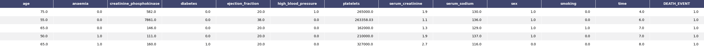

# Heart Failure predictions

The goal of this project is to predict death events due to heart failure events. 
The project pipeline is built entierly on the AzureML ecosystem and relies on AutoML and HyperDrive to find and tune the best model.
The final model is deployed and an endpoint is available for real-time predictions.

## Dataset

### Overview

The [Heart Failure Predictions](https://www.kaggle.com/andrewmvd/heart-failure-clinical-data) Dataset used in this project is publicly available on Kaggle.

> Cardiovascular diseases (CVDs) are the number 1 cause of death globally, taking an estimated 17.9 million lives each year, which accounts for 31% of all deaths worlwide.
Heart failure is a common event caused by CVDs and this dataset contains 12 features that can be used to predict mortality by heart failure.

### Task

In this project we will train a classifier to predict the likelihood of a person to have a death event due to cardiovascular diseases.

In the image below we show a sample of the dataset we use


### Access

In order to access and use the data to train our models in the AzureML Studio we [create a Dataset](https://docs.microsoft.com/it-it/azure/machine-learning/how-to-create-register-datasets) reference, i.e. a `TabularDataset`, using the option *from a local file*

## Automated ML

```python
automl_settings = {
    "task": 'classification',
    "iterations": 30,
    "experiment_timeout_minutes": 15,
    "primary_metric": 'accuracy',
    "training_data": dataset,
    "label_column_name": 'DEATH_EVENT',
    "n_cross_validations": 3,
    "max_concurrent_iterations": 8,
    "max_cores_per_iteration": -1
}
```
The settings used for the exploration of the model space with AutoML are quite limited in time and number of iterations to comply with the use of the 
workspace provided by Udacity. Nonetheless, to optimize computation speed we make use of concurrent iterations and maximum number of cores available.
Since we are tackling a classification problem, with a balancede dataset, the metric we want to optimize is the simple accuracy.
To train and evaluate the model we run a 3-fold cross validation. 

### Results

The best model generated by AutoML is a VotingEnsemble method that relies on a pre-trained `LightGBMClassifier` with a pre-processing . 


The best model was obtained from the last run of AutoML and a larger search over the model space might improve performance. 

*TODO* Remeber to provide screenshots of the `RunDetails` widget as well as a screenshot of the best model trained with it's parameters.


## Hyperparameter Tuning

The model of choice for this project is the `RandomForestClassifier` available in SKlearn.
A random forest is a meta estimator that fits a number of decision tree classifiers on various sub-samples of the dataset.
This model is typically used as a baseline is many projects and Kaggele competitions.
In AzureML we run HyperDrive on two parameters, which are arguably the two most important ones:
    * `n-estimators`: the number of estimators, i.e. trees, in the forest. It's in range [50, 300]
    * `max-depth`: the maximum depth of each tree, i.e. how many split each tree can perform. It's in range [1, 20]

### Results

After 30 iterations of HyperDrive the best model found achieved an accuracy of 80% as shown in the image below


To further improve this model we could tune other parameters such as the `criterion` used to define the optimal split and the `[min]/[max]_samples_leaf` number
of samples in the leaf node of each tree.

## Model Deployment

To deploy the best model found by AutoML we use the AzureML Endpoint. The best model is deployed following this steps:

1. Register the model and download its artifacts
2. Create an environment with all required dependencies using the artifacts provided by AutoML
3. Define the configurations of the WebService, i.e. number of CPUs and memory size
4. Deploy the model with the previously created configurations
5. Enable app insights to debug and analyze the behaviour of the endpoint


In order to query and consume the endpoint we have to make a request with a JSON body where the `data` field is the dictionary representation of the data point
to predict
```
{
    'age': 75.0, 
    'anaemia': 0.0, 
    'creatinine_phosphokinase': 582.0, 
    'diabetes': 0.0, 
    'ejection_fraction': 20.0, 
    'high_blood_pressure': 1.0, 
    'platelets': 265000.0, 
    'serum_creatinine': 1.9, 
    'serum_sodium': 130.0, 
    'sex': 1.0, 
    'smoking': 0.0, 
    'time': 4.0
}
```

## Screen Recording

[](https://youtu.be/8VfUFRkeNfU "Screencast deployed model")
